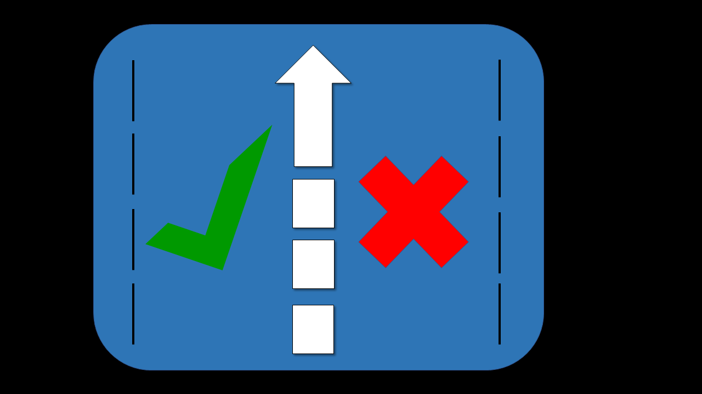

Autor: Johana Rangel
johanarang@hotmail.com\

# proyecto_inicial
Primer proyecto integrador.

# Título del proyecto.
Verificación de permisos de circulación provincial.

# Descripción. 
Es un programa que permite la verificación de perimisos de circulación para el ingreso a provincia. 
Está realizado con el lenguaje de programación Python. Funciona con un menu que tiene tres acciones a realizar:

Acción 1: validación de la empresa, donde permite ingresar el nombre de ésta, la actividad, también los datos del empleado; nombre, apellido, DNI y código de circulación obtenido (información almacenada en un archivo CSV)

Acción 2: datos a validar (este dato será el código de circulación emitido por la provincia de destino), luego el proceso consiste en verificar en la base de datos anterior si ingresa o no, mostrando por pantalla la información. En caso ingrese, la información queda asentada en un segundo archivo CSV.

Acción 3: salir del programa

# Diagrama de flujo.

# Ejemplo de una función aplicada en el programa.

def ingresa():
    
    '''Función creada para imprimir por pantalla si el código ingresado 
    tiene permiso para acceso provincial o no.
    '''
         
    try:
        codigo = int(input('Ingrese "CÓDIGO DE CIRCULACIÓN":\n Ingrese 3, para salir\n'))

    #Capturando error de excepción para los datos que ingresen diferente al formato indicado.

    except:
        print('El valor indicado no corresponde con lo indicado. Intente nuevamente.')
        codigo = int(input('Ingrese "CÓDIGO DE CIRCULACIÓN":\n Ingrese 3, para salir\n')) 

    if codigo != 3:
        
        '''Si el codigo en diferente a tres, se abre el archivo csv
        "validacionempresas.csv" cuya data se convierte en una lista. 
        Luego se crea una variable llamada "cantidad_filas" que es 
        igual a la longitud de la la data.
        '''

        persona_ingresada = [] #Variable que almacenará los datos de la persona que tenga permiso de ingreso provincial.
        
        with open('validacionempresas.csv') as csvfile:
            data = list(csv.DictReader(csvfile))
            cantidad_filas = len(data)

        #Luego con el bucle for se recorre el range cantidad de filas
        # Para poder extraer la información de cada columna.                                    
            
            for i in range(cantidad_filas):
                row = data[i]
                codigos = int(row.get('Codigo'))
                dni = int(row.get('DNI'))
                nombre_empresa = str(row.get('Nombre empresa'))
                actividad = str(row.get('Actividad'))
                nombre_empleado = str(row.get('Nombre empleado'))
                apellido_empleado = str(row.get('Apellido empleado'))

                #Luego considerando el valor del código ingresado para validar, 
                #se forma una condición para buscarlo en la lista contenida
                #por la varible "codigos", en caso sean iguales, se van agregando
                #los demás datos que le acompañan como el dni, nombre_empresa,
                #actividad, nombre_empleado y apellido_empleado en una lista 
                #llamada "persona_ingresada"

                if codigos == codigo:
                    persona_ingresada.append(codigo)
                    persona_ingresada.append(dni)    
                    persona_ingresada.append(nombre_empresa)
                    persona_ingresada.append(actividad)
                    persona_ingresada.append(nombre_empleado)
                    persona_ingresada.append(apellido_empleado)
    
# Muchas gracias!
Cualquier duda o sugerencia pueden contartarse con Johana Rangel al mail johanarang@hotmail.com 

# Fecha de última actualización.
13 de septiembre 2020

